# hse_hw1_meth
### Вычисления выполнены в google colab https://colab.research.google.com/drive/1TTgmcF5pBZVinzLC0rFaKoNfNkPH-q9J#scrollTo=Z64j6NUOzC9x

## 1
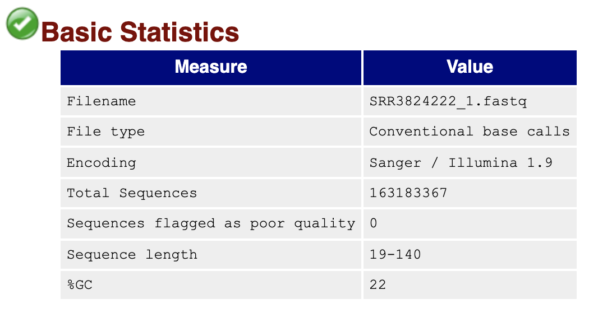
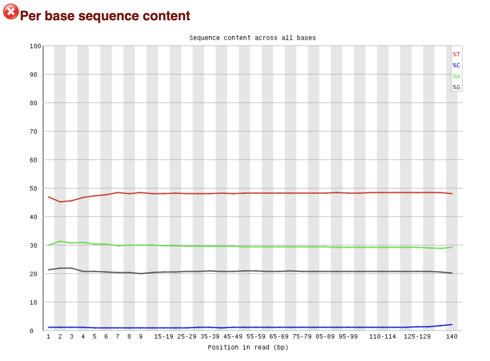
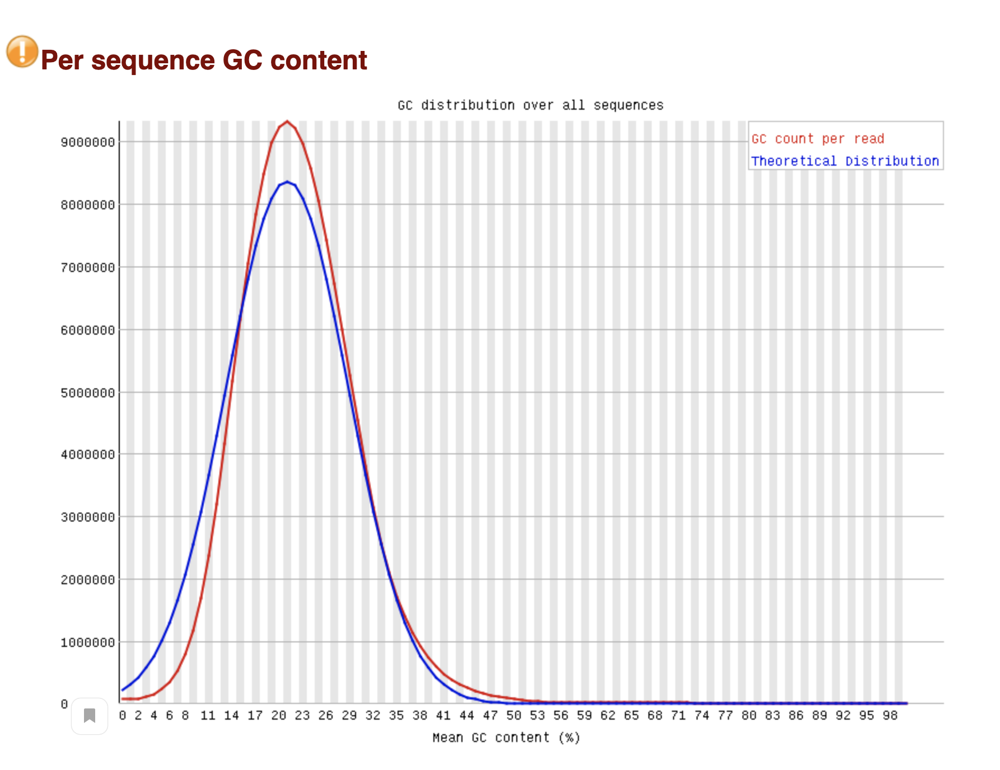
 
Основное отличие заключается в том, что есть сильные отличия в количестве нуклеотидов (В РНК их количество примерно одинаково). Тимина больше всего и больше чем в РНК. Цитозина же напротив почти нет. Это можно объяснить особенностями секвенирования: цитозин читается как тимин из за бисульфита.

Так же можем отметить, что распределение GC состава сдвинуто в сторону меньших процентов.

## 2
Количество ридов и степень дедупликации приведена в таблице.

## 3 mbias
8 cell |	ICM |  Epiblast
-|-|-
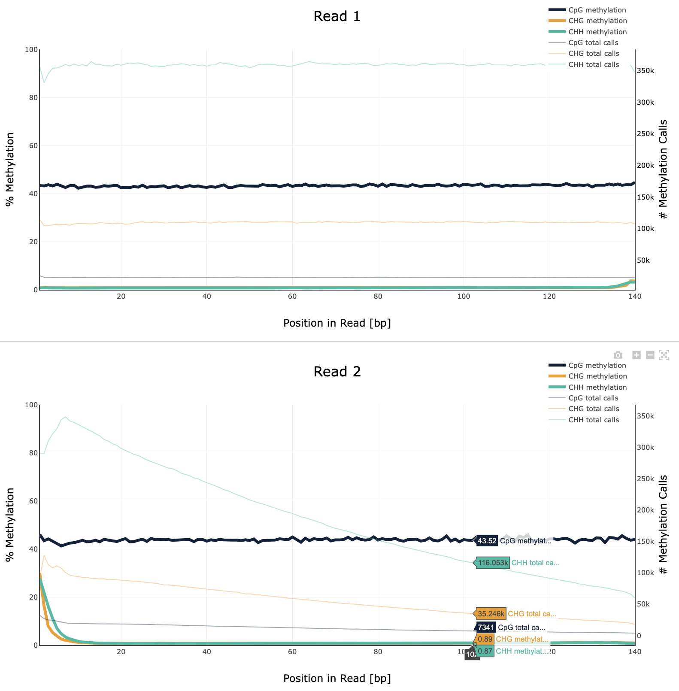 |	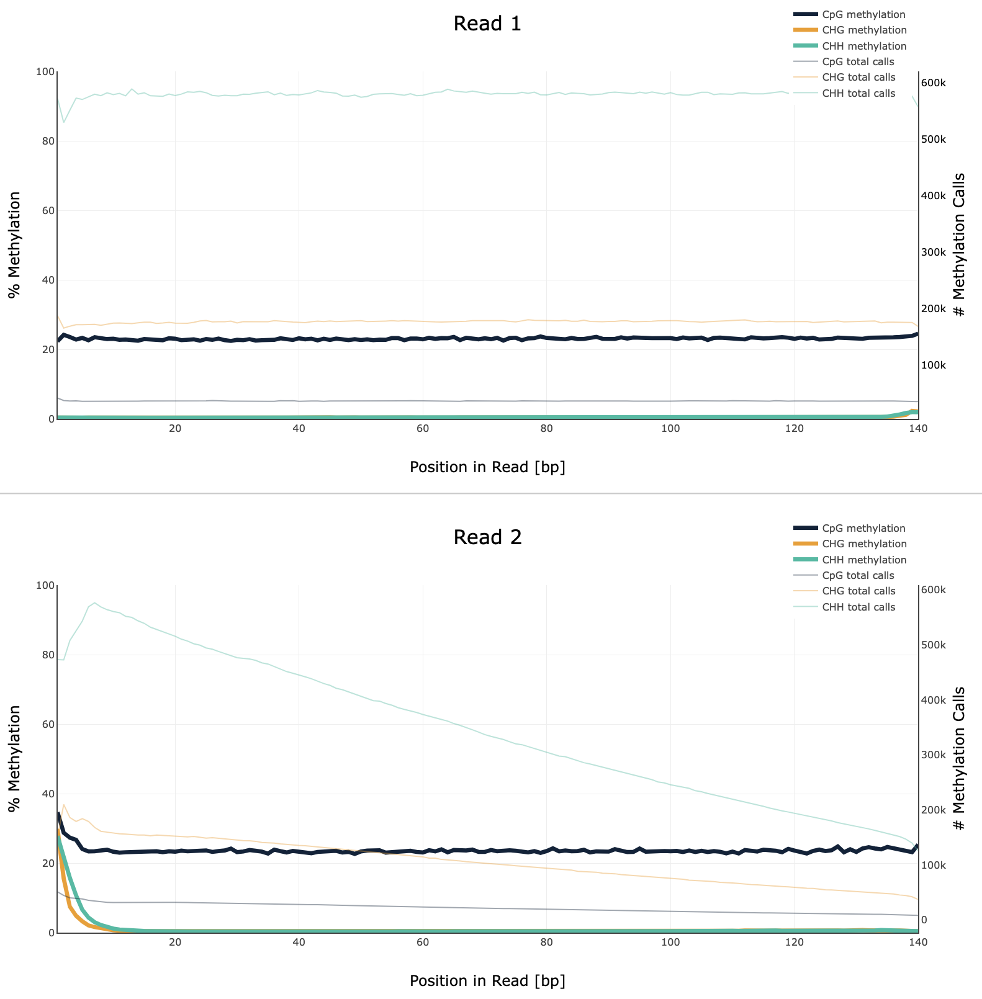 |	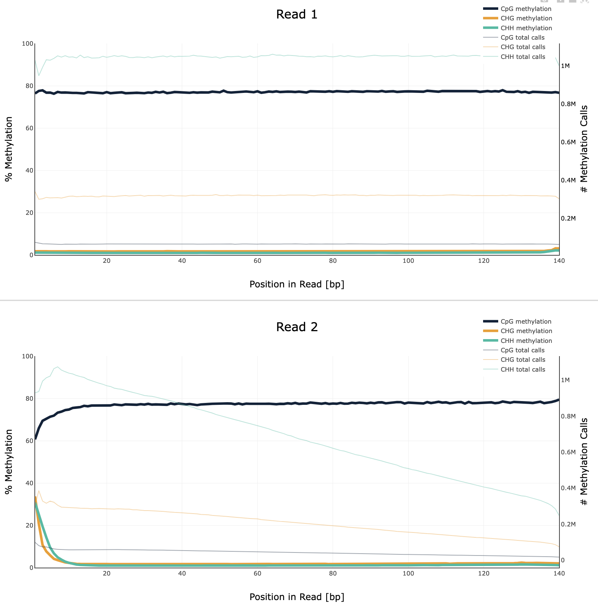

В первой стадии - 8cell 43% метилирования. Во второй стадии -  ICM 23%, и в epiblast - 78%.

## 4 Распределение метилирования

8 cell |	ICM |  Epiblast
-|-|-
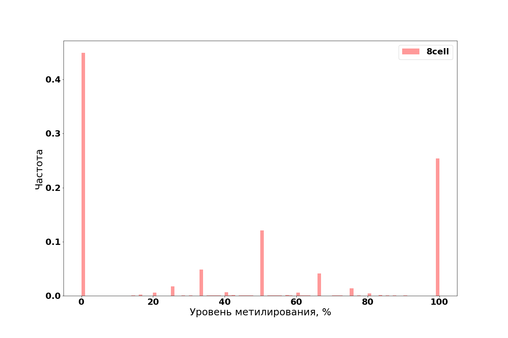 |	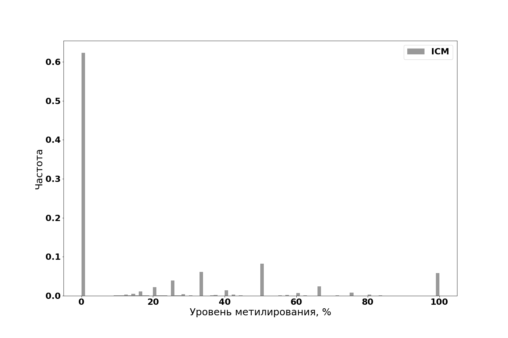 |	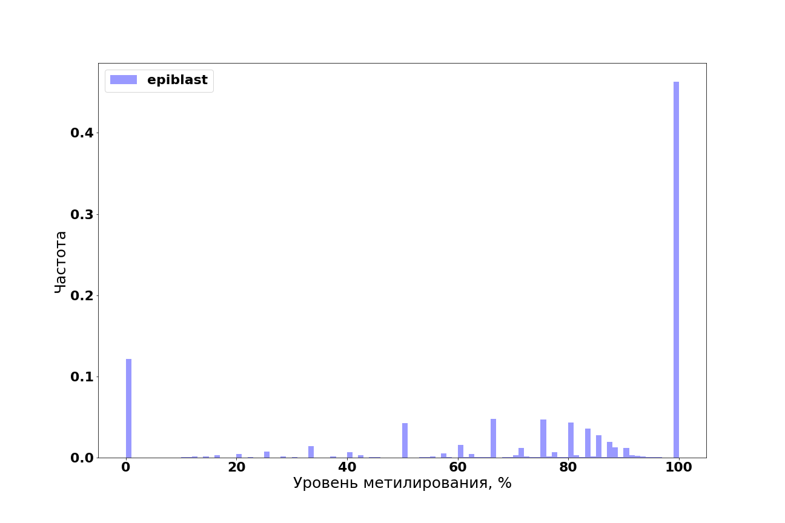

И суммарный график 
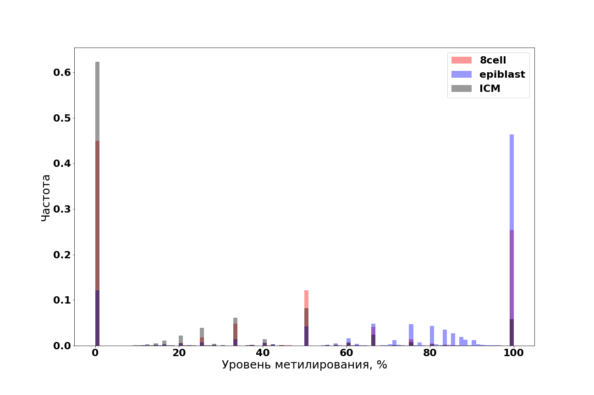

## 5 Покрытие
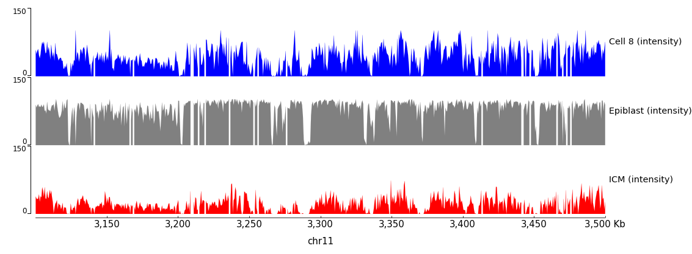
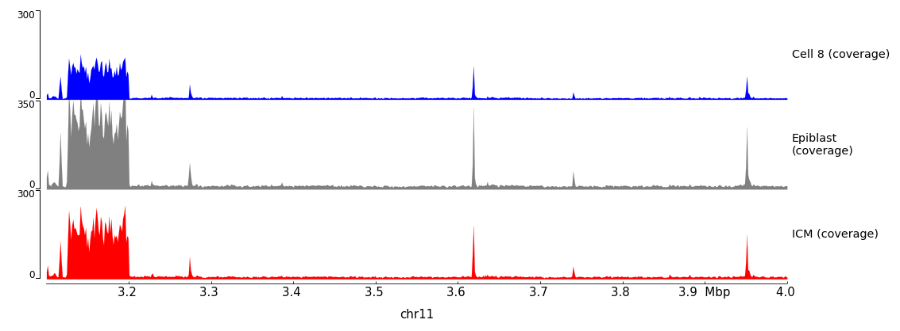
