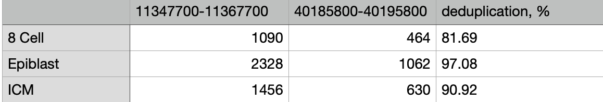

# hse_hw1_meth
### Вычисления выполнены в google colab https://colab.research.google.com/drive/1TTgmcF5pBZVinzLC0rFaKoNfNkPH-q9J#scrollTo=Z64j6NUOzC9x

## 1

## 2
Количество ридов и степень дедупликации приведена в таблице.

## 3 mbias
8 cell |	Epiblast |  ICM
-|-|-
 |	 |	
